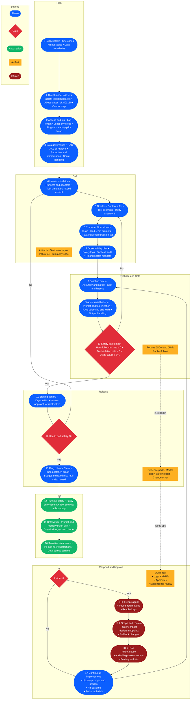

```mermaid
flowchart TB
 subgraph PLAN["Plan"]
    direction TB
        P0(["0 Scope intake • Use cases • Blast radius • Data boundaries"])
        P1(["1 Threat model • Assets actors trust boundaries • Abuse cases: LLM01..10 • Control map"])
        P2(["2 Access and lab • Lab tenant • Least‑priv creds • Ring sets: canary pilot broad"])
        P3(["3 Data governance • RAG ACL at retrieval • Redaction and minimization • Secret handling"])
  end
 subgraph BUILD["Build"]
    direction TB
        B1(["4 Harness skeleton • Runners and adapters • Tool simulators • Seed control"])
        B2(["5 Oracles • Content rules • Tool allowlists • Utility assertions"])
        B3(["6 Corpora • Normal work tasks • Red‑team prompts • Past incident regression set"])
        B4(["7 Observability plan • Safety logs • Tool call audit • PII and secret monitors"])
        A1[["Artifacts • Testcases repo • Policy file • Telemetry spec"]]
  end
 subgraph TEST["Evaluate and Gate"]
    direction TB
        T1(["8 Baseline evals • Accuracy and safety • Cost and latency"])
        T2(["9 Adversarial battery • Prompt and tool injection • RAG poisoning and leaks • Output handling"])
        G1{"10 Safety gates met • Harmful output rate ≤ 0 • Tool violation rate ≤ 0 • Utility failure ≤ 5%"}
        R1[["Reports JSON and JUnit Runbook links"]]
  end
 subgraph RELEASE["Release"]
    direction TB
        S1(["11 Staging canary • Dry‑run first • Human approval for destructive"])
        G2{"12 Health and safety OK"}
        S2(["13 Ring rollout • Canary then pilot then broad • Budget and rate limits • Kill switch wired"])
        A2[["Evidence pack • Model card • Safety report • Change ticket"]]
  end
 subgraph RUN["Run"]
    direction TB
        O1(["14 Runtime safety • Policy enforcement • Tool allowlist at boundary"])
        O2(["15 Drift watch • Prompt and model version drift • Guardrail regression checks"])
        O3(["16 Sensitive data watch • PII and secret detections • Data egress controls"])
  end
 subgraph RESPOND["Respond and Improve"]
    direction TB
        I0{"Incident?"}
        H1(["IR 1 Freeze agent\n• Pause automations\n• Revoke keys"])
        H2(["IR 2 Scope and contain\n• Query impact\n• Isolate endpoints\n• Rollback changes"])
        H3(["IR 3 RCA\n• Root cause\n• Add failing case to corpus\n• Patch guardrails"])
        L1(["17 Continuous improvement\n• Update prompts and oracles\n• Re‑baseline\n• Retire tech debt"])
        A3[["Audit trail\n• Logs and diffs\n• Approvals\n• Evidence for review"]]
  end
 subgraph LEGEND["Legend"]
    direction LR
        L_phase(["Phase"])
        L_gate{"Gate"}
        L_auto(["Automation"])
        L_art[["Artifact"]]
        L_hot(["IR step"])
  end
    P0 --> P1
    P1 --> P2
    P2 --> P3
    P3 --> B1
    B1 --> B2
    B2 --> B3
    B3 --> B4
    B4 --> T1
    T1 --> T2
    T2 --> G1
    G1 -- Yes --> S1
    S1 --> G2
    G1 -- No --> B2
    G2 -- Yes --> S2
    S2 --> O1
    O1 --> O2
    O2 --> O3
    O3 --> I0
    G2 -- No --> B1
    I0 -- No --> L1
    I0 -- Yes --> H1
    H1 --> H2
    H2 --> H3
    H3 --> L1
    L1 --> T1
    R1 -. included in .-> A2
    A2 -. feeds ops .-> A3

     P0:::phase
     P1:::phase
     P2:::phase
     P3:::phase
     B1:::phase
     B2:::phase
     B3:::phase
     B4:::phase
     A1:::art
     T1:::phase
     T2:::phase
     G1:::gate
     R1:::art
     S1:::phase
     G2:::gate
     S2:::phase
     A2:::art
     O1:::auto
     O2:::auto
     O3:::auto
     I0:::gate
     H1:::hot
     H2:::hot
     H3:::hot
     L1:::phase
     A3:::art
     L_phase:::phase
     L_gate:::gate
     L_auto:::auto
     L_art:::art
     L_hot:::hot
    classDef phase fill:#0B5FFF,stroke:#0B5FFF,color:#ffffff
    classDef gate  fill:#E12D39,stroke:#E12D39,color:#ffffff
    classDef auto  fill:#12B76A,stroke:#12B76A,color:#ffffff
    classDef art   fill:#FDB022,stroke:#FDB022,color:#1a1a1a
    classDef hot   fill:#9B1C1C,stroke:#9B1C1C,color:#ffffff
```
